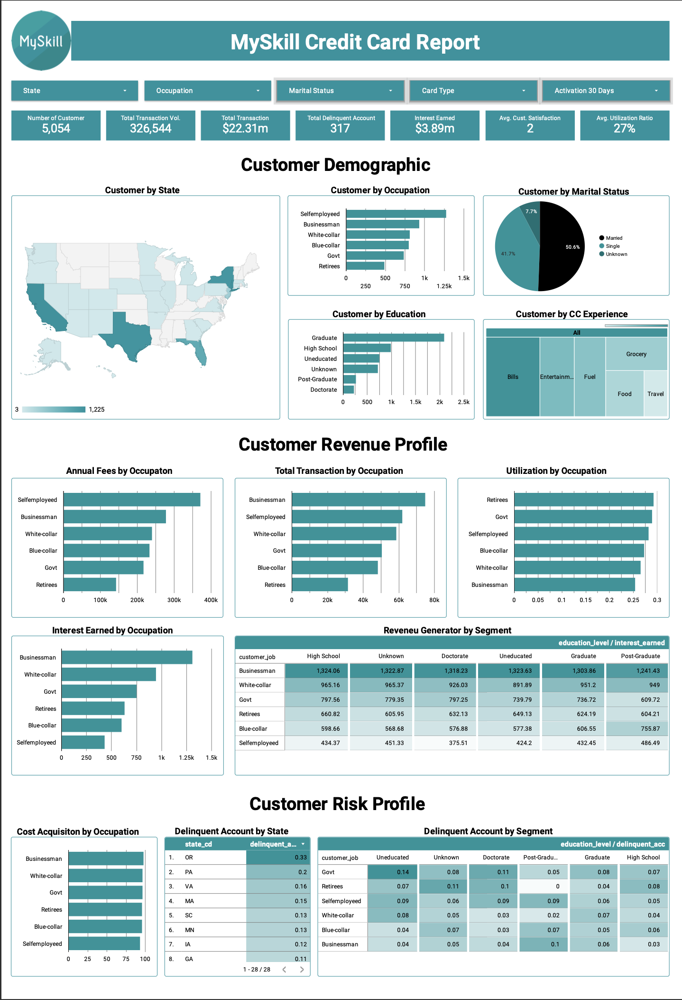

# Credit Card Customer Analysis Dashboard

This project analyzes credit card customer data to evaluate customer demographics, transaction behavior, revenue contribution, and risk profile. The goal is to generate actionable insights to support data-driven decisions in customer strategy and risk management.

---

## Live Dashboard
[View Interactive Dashboard](https://datastudio.google.com/reporting/863f622f-992b-45d2-b0c3-4d031bdde7c8)

---

## Business Problem
How can we better understand customer behavior, revenue contribution, and risk profiles to improve targeting strategies, increase profitability, and manage credit risk effectively?

---

## Dataset
- Source: Credit card customer dataset (MySkill project)  
- Data includes: customer demographics, transactions, revenue, utilization ratio, and delinquent accounts  
- Total Customers: 5,054  
- Total Transaction Volume: 326,544  
- Total Transaction Value: $22.31M  
- Total Delinquent Accounts: 317  
- Interest Earned: $3.89M  
- Average Utilization Ratio: 27%  

---

## Tools
- Looker Studio (Dashboard)  
- SQL / Excel (data preparation)  

---

## Process
- Cleaned and validated customer and transaction data  
- Aggregated key metrics (customers, revenue, transactions, delinquency)  
- Performed segmentation analysis by:
  - Occupation  
  - Education  
  - Marital status  
  - State  
- Analyzed revenue contribution and utilization behavior  
- Evaluated risk through delinquent account patterns  
- Built an interactive dashboard with filters for deeper analysis  

---

## Key Metrics
- Total Customers: 5,054  
- Total Transactions: $22.31M  
- Interest Earned: $3.89M  
- Delinquent Accounts: 317  
- Avg Utilization Ratio: 27%  

---

## Key Insights
- **Businessman and White-collar segments** generate the highest revenue and transaction activity  
- Customer base is dominated by **married individuals (~50%)**, indicating strong household-driven financial behavior  
- Certain states show higher **delinquency rates**, highlighting geographic risk concentration  
- Higher utilization ratios in specific segments indicate potential credit risk exposure  
- Revenue distribution across segments reveals opportunities for targeted marketing and customer retention  

---

## Recommendations
- Prioritize high-value segments (Businessman & White-collar) for targeted marketing and retention strategies  
- Implement risk mitigation strategies in high-delinquency regions  
- Monitor high-utilization customers to reduce potential credit default risk  
- Develop segmentation-based campaigns to improve engagement and revenue  
- Optimize credit policies to balance growth and risk across customer groups  

---

## Business Impact
This analysis enables financial institutions to improve customer targeting, increase revenue from high-value segments, and reduce credit risk through data-driven decision-making.

---

## Dashboard Preview

---

## Author
Ahmad Iqbal Maulana
